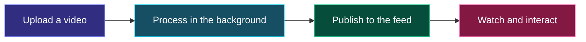

<div align="center">

# ▶ StreamForge

**Upload once. Press play. Share the conversation.**

A video platform built to learn how streaming works—from upload to playback.

<p>
  
  
  
  
</p>

[Get started](#get-started) · [How it works](#how-it-works) · [Explore the docs](#explore-the-docs)

</div>

---

StreamForge turns uploaded videos into multiple playback qualities, adds them to
a browsable feed, and gives each video a watch page. It pairs an Angular web app
with .NET microservices that handle accounts, uploads, processing, and engagement.

## What you can do

| | Feature | What it means |
| --- | --- | --- |
| 📤 | **Upload** | Sign in and upload MP4, MOV, WebM, or MKV videos up to 1 GB. |
| ▶️ | **Watch** | Stream with automatic or manual quality selection, up to 1080p when the source supports it, with MP4 fallback. |
| 🧭 | **Discover** | Search ready videos as you type, browse the feed, and find recommendations. |
| 💬 | **Interact** | Like or dislike, post and manage your comments, and see view counts. |
| 🔗 | **Share** | Copy a stable watch-page link with the creator's public name on display. |

Browsing and playback are public. Create an account to upload, react, and comment.

## How it works



**Under the hood:** YARP routes API requests to the .NET services. Kafka carries
background events, FFmpeg prepares video qualities, and MinIO stores private
media served through signed URLs. PostgreSQL stores durable data; Redis handles
login sessions and engagement counters; Elasticsearch powers live video
suggestions. HLS adapts playback quality as bandwidth changes.

## Get started

You'll need **Docker Desktop**, **PowerShell**, and the **.NET 10 SDK** for local
HTTPS certificates. Run these commands from the repository root:

```powershell
# First-time setup: create your local configuration.
Copy-Item .env.example .env
./infra/docker/setup-local-https.ps1 -Trust
```

Replace every placeholder in `.env` with your local credentials, then start:

```powershell
docker compose --env-file .env -f infra/docker/compose.yml up --build
```

Open **[StreamForge → https://localhost:8443](https://localhost:8443)**, create an
account, and upload your first video. It appears in the feed when processing finishes.

The first build takes longer because it compiles MinIO from its pinned source release.
See the [setup guide](docs/development/setup.md) for local development, tests, and
the database and storage consoles.

<details>
<summary><strong>Stop the local stack</strong></summary>

This preserves uploaded videos and stored data:

```powershell
docker compose --env-file .env -f infra/docker/compose.yml down
```

</details>

## Explore the docs

| Start here | What you'll find |
| --- | --- |
| [Development setup](docs/development/setup.md) | Prerequisites, configuration, build, and test commands |
| [Architecture](docs/architecture/README.md) · [Decisions](docs/architecture/decisions/README.md) | Service ownership and the reasoning behind the design |
| [API reference](docs/api/README.md) | HTTP endpoints and event contracts |
| [Operations](docs/operations/runbooks/README.md) · [Authentication & HTTPS](docs/operations/runbooks/authentication.md) | Troubleshooting and local certificate setup |

<div align="center">
  <sub>A learning project exploring distributed systems through video.</sub>
</div>
